# KOTTANS-FRONTED

## Tasks
- [x] [Git Basics](#git-та-github)
- [x] [Linux CLI, and HTTP](#linux-cli-and-http)
- [x] [Git Collaboration](#git-collaboration)
- [x] [Intro to HTML and CSS](#intro-to-html-and-css)
- [x] [Responsive Web Design](#responsive-web-design)
- [x] [HTML CSS Popup](#html-css-popup)
- [x] [JS Basics](#js-basics)
- [x] [DOM](#dom)
- [x] [Tiny JS World](#tiny-js-world)

## Git та GitHub
[Страница задачи на GitHub](https://github.com/kottans/frontend/blob/2022_UA/tasks/git-intro.md)

**1. Прослухайте тижні 1 і 2 курсу Introduction to Git and GitHub**
> 

>   
Week 1

>   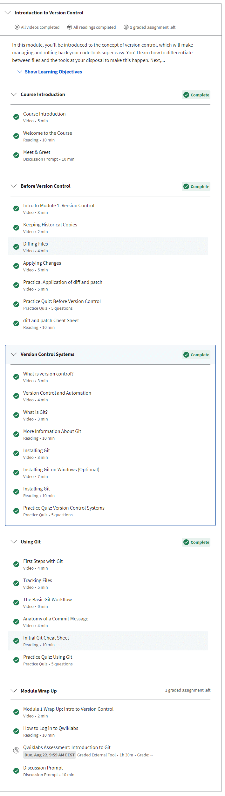
> 

> 

>   
Week 2

>   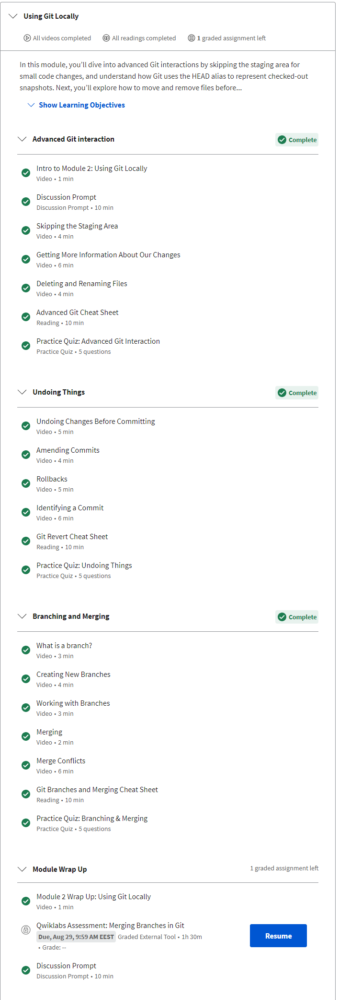
> 

**2. Пройдіть наступні рівні тут learngitbranching.js.org**
> 

>   
Основи: Introduction Sequence, Ramping Up

>   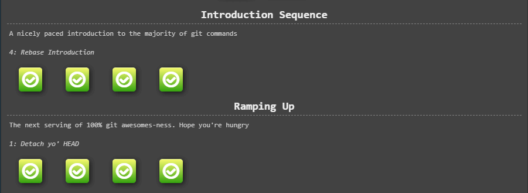
>  

> 

>   
Віддалені репозиторії: Push & Pull

>   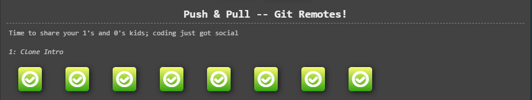
> 

**3. Створіть репозиторій та назвіть його kottans-frontend**
> Результат: [https://github.com/hisbvdis/kottans-frontend](https://github.com/hisbvdis/kottans-frontend)

**4. Створіть README.md для репозиторію**
> Результат: [https://github.com/hisbvdis/kottans-frontend/blob/main/README.md](https://github.com/hisbvdis/kottans-frontend/blob/main/README.md)

**5. Опишіть свої враження від вивченого матеріалу.**
> Освежил некоторые знания по Git, но часть материала не удалось понять

**6. Надішліть pull-request сюди Kottans/mock-repo пропонуючи зміни.**
> [Pull request](https://github.com/kottans/mock-repo/pull/1052)

**опублікуйте повідомлення в course channel: Git Basics — #done**
> [Сообщение в Telegram](https://t.me/c/1382428271/48319)

## Linux CLI, and HTTP
[Страница задачи на GitHub](https://github.com/kottans/frontend/blob/2022_UA/tasks/linux-cli-http.md)

**Додати скріншот або додати посилання на скріншот**
> 

>   
Quiz 1

>   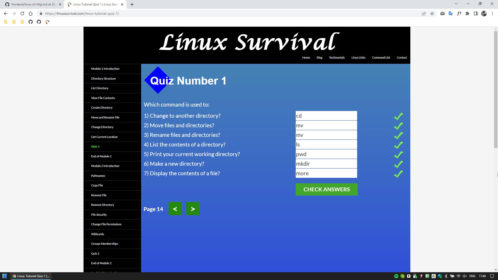
> 

> 

>   
Quiz 2

>   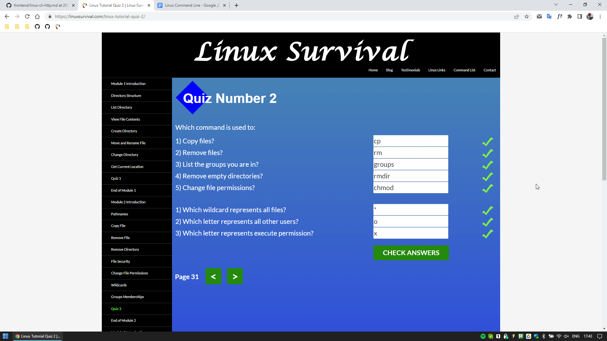
> 

> 

>   
Quiz 3

>   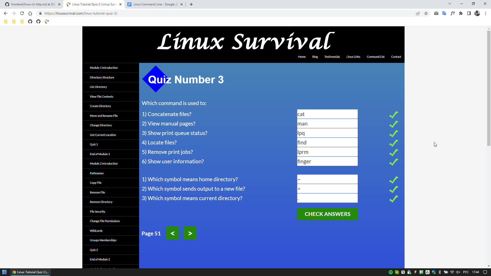
> 

> 

>   
Quiz 4

>   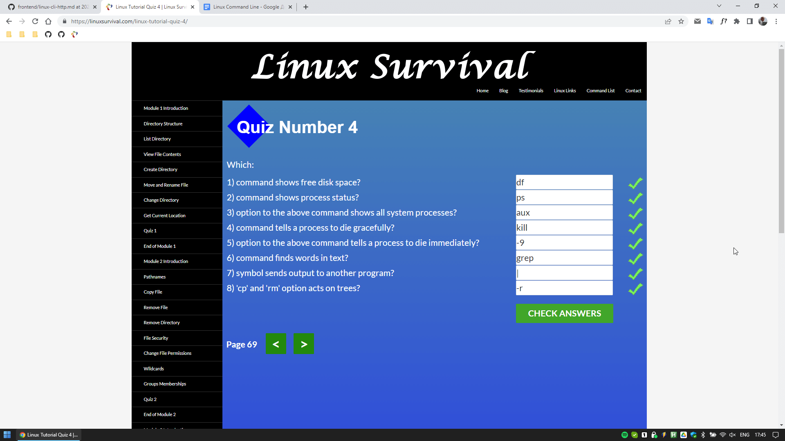
> 

**Перерахуйте свої міркування щодо кожного пункту завдання**

*Linux Survival (4 modules)*
> Было полезно расширить знания использования командной строки Linux

*HTTP: Протокол, який повинен розуміти кожний веб-розробник*
> Некоторые вещи знал. Было полезно освежить

**Опублікувати повідомлення в course channel: Linux CLI and HTTP — #done**
> [Сообщение в Telegram](https://t.me/c/1382428271/44138)

## Git Collaboration
[Страница задачи на GitHub](https://github.com/kottans/frontend/blob/2022_UA/tasks/git-collaboration.md)

**Зробіть скріншот своїх завершених уроків**

*Coursera*
> 

>   
Week 1

>   
> 

> 

>   
Week 2

>   
> 

> 

>   
Week 3

>   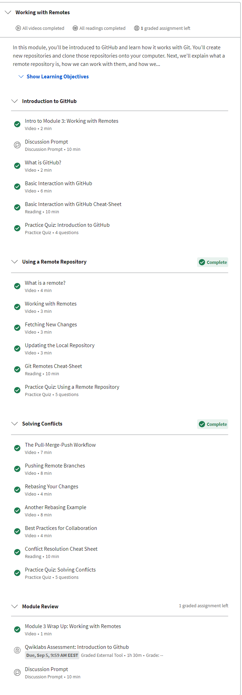
> 

> 

>   
Week 4

>   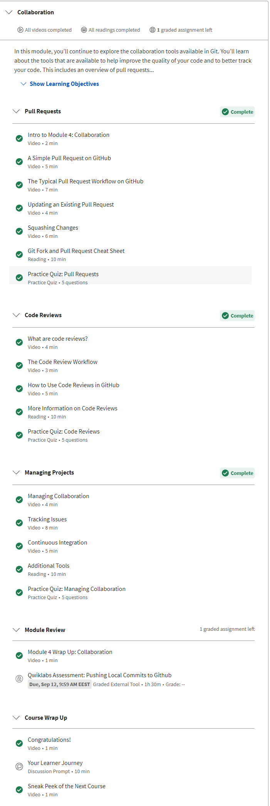
> 

*Learngitbranching*
> 

>   
Основи: Introduction Sequence, Ramping Up

>   
> 

> 

>   
Віддалені репозиторії: Push & Pull

>   
> 

> 

>   
Основи: Переміщуємо роботу туди-сюди

>   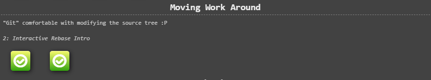
> 

> 

>   
Основи: Переміщуємо роботу туди-сюди

>   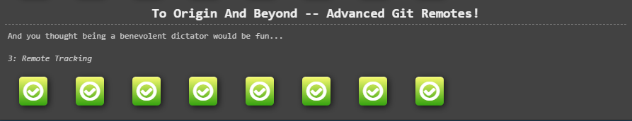
> 

**Опублікувати повідомлення в course channel**
> [Сообщение в Telegram](https://t.me/c/1382428271/46010)

## Intro to HTML and CSS
[Страница задачи на GitHub](https://github.com/kottans/frontend/blob/2022_UA/tasks/html-css-intro.md)

**Додати скріншот або додати посилання на скріншот**

*Coursera*
> 

>   
Week 1

>   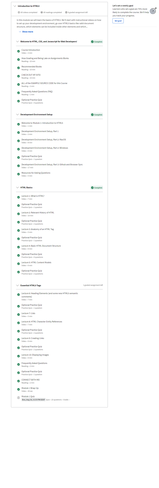
> 

> 

>   
Week 2

>   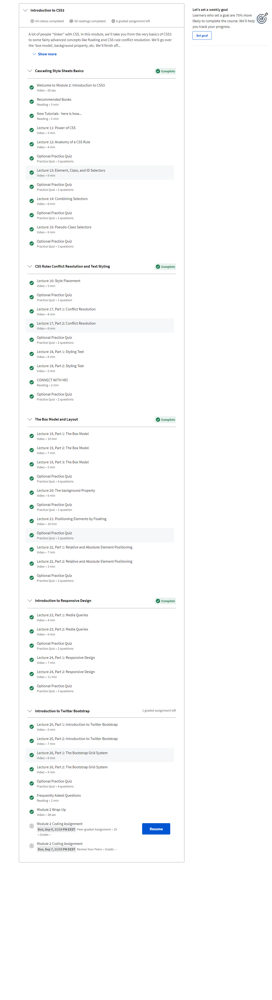
> 

*Codecademy*
> 

>   
HTML & CSS

>   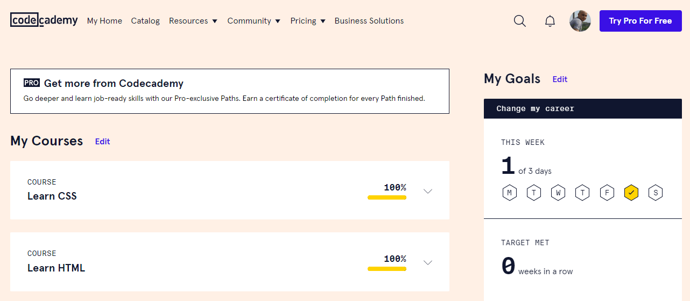
> 

**Опублікувати повідомлення в course channel: Intro to HTML and CSS — #done**
> [Сообщение в Telegram](https://t.me/c/1382428271/46274)

## Responsive Web Design
[Страница задачи на GitHub](https://github.com/kottans/frontend/blob/2022_UA/tasks/html-css-responsive.md)

**Додати скріншот або додати посилання на скріншот**
> 

>   
FLEXBOX FROGGY

>   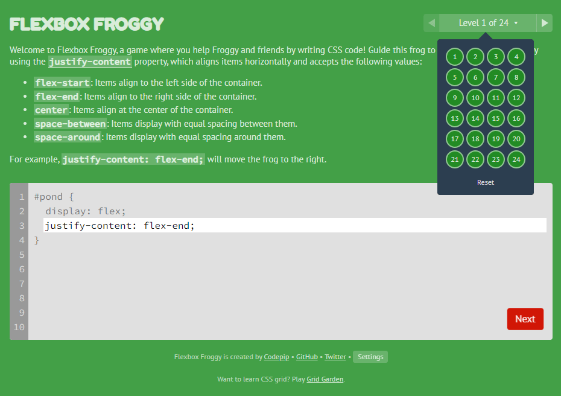
> 

> 

>   
GRID GARDEN

>   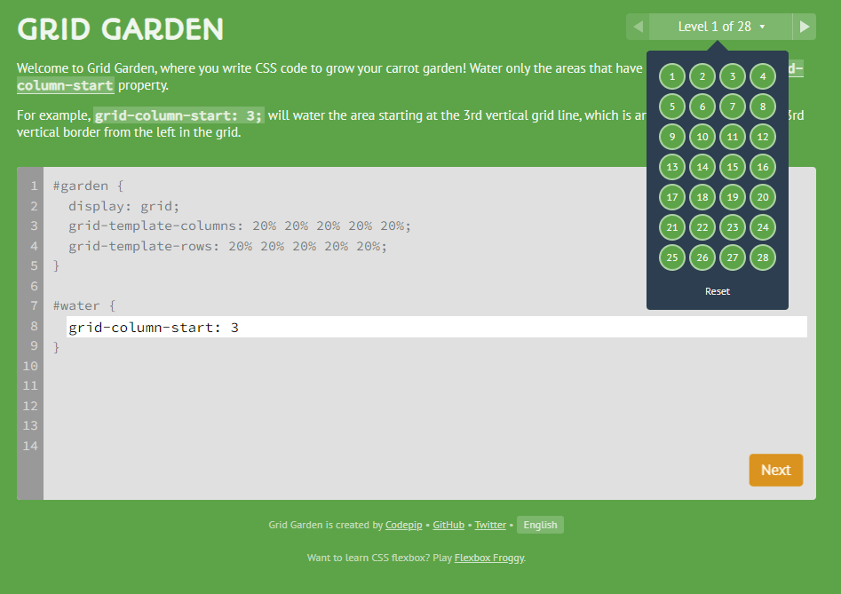
> 

**Перерахуйте свої міркування щодо кожного пункту завдання**
> Flexbox и Grid — интересная тема, с которой уже знаком. 
> Много раз уже приходилось проходить эти игры.

**Опублікувати повідомлення в course channel: Responsive Web Design — #done**
> [Сообщение в Telegram](https://t.me/c/1382428271/46283)

## HTML CSS Popup
[Страница задачи на GitHub](https://github.com/kottans/frontend/blob/2022_UA/tasks/html-css-popup.md)

**App має власний спеціальний проект/репозиторій**
> Github: [https://github.com/hisbvdis/kottans-homework-html-css-popup](https://github.com/hisbvdis/kottans-homework-html-css-popup)

**App опубліковано на GitHub pages**
> Github Pages: [ссылка](https://hisbvdis.github.io/kottans-frontend/pages/html-css-popup/)

**Для цього завдання вам знадобиться review коду**
> [Pull request](https://github.com/kottans/frontend-2022-homeworks/pull/247)

**Work**
> - [Demo](https://hisbvdis.github.io/kottans-frontend/pages/html-css-popup/)
> - [Code base](https://github.com/hisbvdis/kottans-frontend/tree/main/pages/html-css-popup)

## JS Basics
[Страница задачи на GitHub](https://github.com/kottans/frontend/blob/2022_UA/tasks/js-basics.md)

**Зробіть скріншот своїх завершених уроків**

*Coursera*
> 

>   
Introduction to Javascript (Week 4)

>   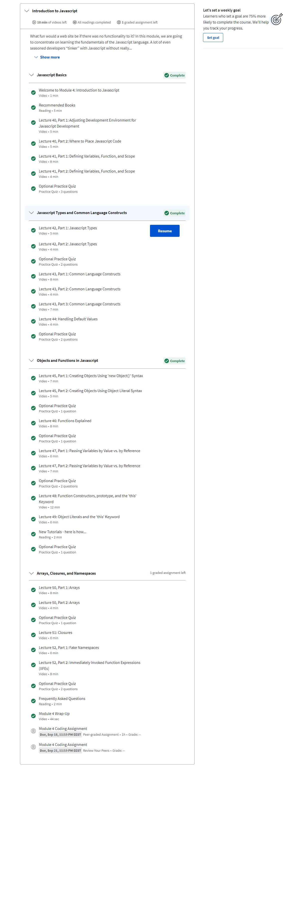
> 

*FreeCodeCamp*
> 

>   
Basic JavaScript

>   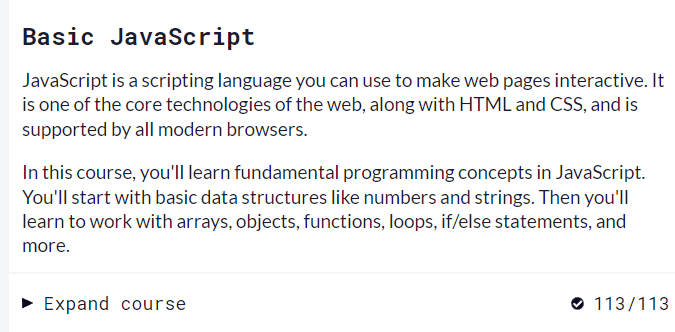
> 

> 

>   
ES6 Challenges

>   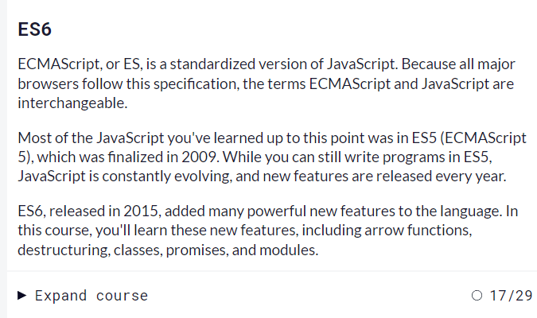
> 

> 

>   
Basic Data Structures

>   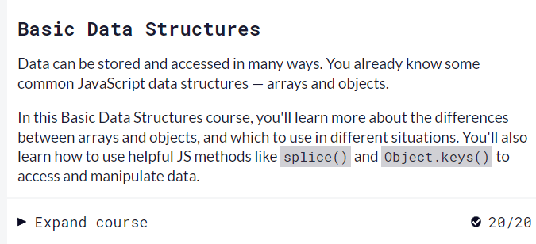
> 

> 

>   
Basic Algorithm Scripting

>   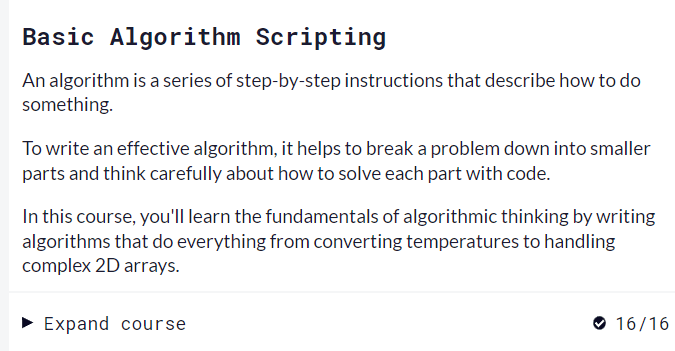
> 

> 

>   
Functional Programming

>   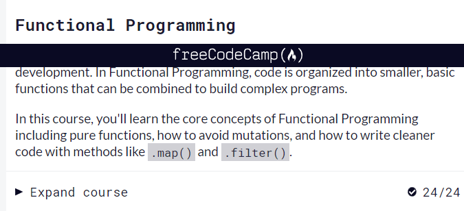
> 

> 

>   
Algorithm Scripting Challenges

>   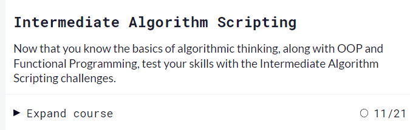
> 

**Перерахуйте свої міркування**
> Очень интересно решать задачки с помощью функционала ES6

**Опублікувати повідомлення в course channel: JS Basics — #done**
> [Сообщение в Telegram](https://t.me/c/1382428271/47546)

## DOM
[Страница задачи на GitHub](https://github.com/kottans/frontend/blob/2022_UA/tasks/js-dom.md)

**Зробіть скріншот своїх завершених уроків**

*Coursera*
> 

>   
Using Javascript to Build Web Applications (Week 5)

>   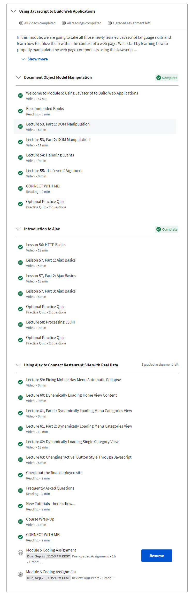
> 

*FreeCodeCamp*
> 

>   
Algorithm Scripting Challenges

>   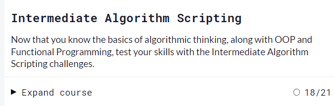
> 

**Практичне завдання: Впровадити інтерактивне side-menu**
> - [Demo](https://hisbvdis.github.io/kottans-frontend/pages/dom)
> - [Code base](https://github.com/hisbvdis/kottans-frontend/tree/main/pages/dom)

**Для цього завдання вам знадобиться review коду**
> [Pull request](https://github.com/kottans/frontend-2022-homeworks/pull/312)

## Tiny JS World
[Страница задачи на GitHub](https://github.com/kottans/frontend/blob/2022_UA/tasks/js-pre-oop.md)

**Створіть a tiny JS world model**
> - [Demo](https://hisbvdis.github.io/kottans-frontend/pages/a-tiny-JS-world/)
> - [Code base](https://github.com/hisbvdis/kottans-frontend/tree/main/pages/a-tiny-JS-world)

**Для цього завдання вам знадобиться review коду**
> [Pull request](https://github.com/kottans/frontend-2022-homeworks/pull/317)